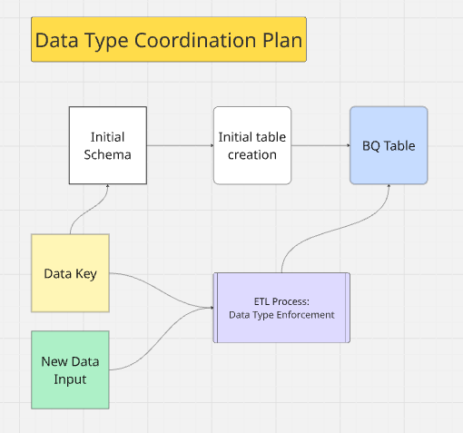
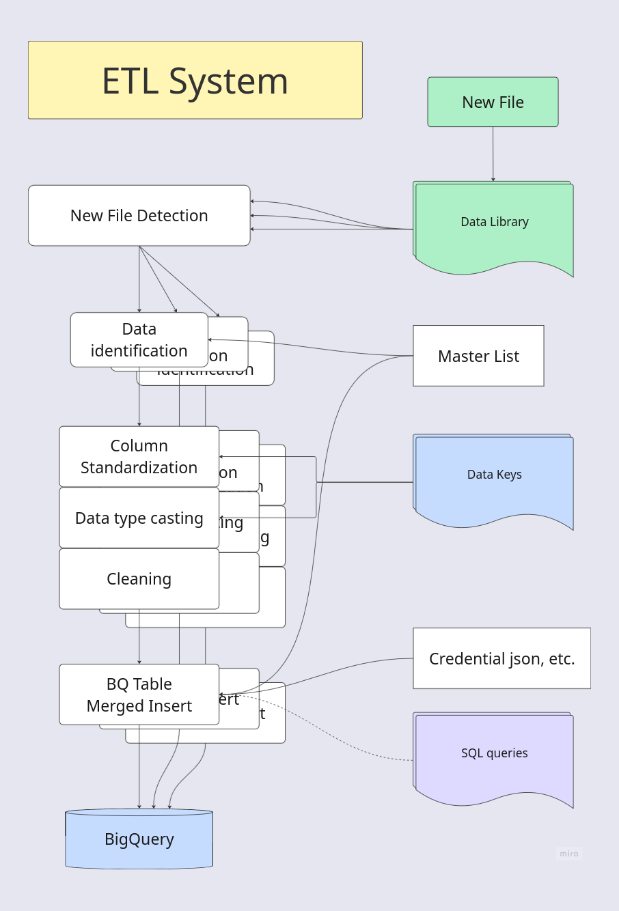
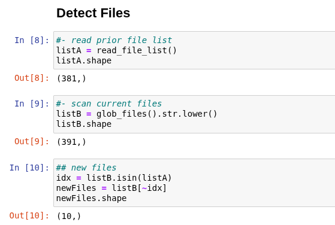
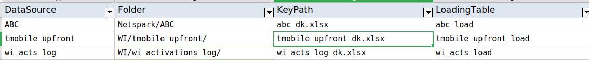
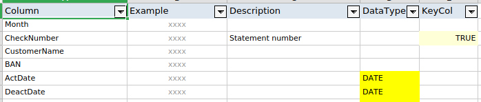

# ETL System
An original code system for extracting / importing, transforming, and loading data into the company BigQuery data pipeline. 

This repository hosts selections from that code.

**Tech Stack:** Python, pandas, Google BigQuery

# The Business Problem
I was building a company-wide commissions data pipeline in BigQuery, and initially chose import through Google Cloud Storage / **GCS**. The platform made it easy to start on this method. Google's data type auto-detection created initial tables from initial spreadsheets. GCS accepted data sheets through drag-and-drop. Loading queries could be stored in-system.

But this first-pass system exhibited liabilities.
1. Critically, the system depended on a fixed column order which incoming data sources did not respect. Some incoming data changed column order frequently, making this system impossible.
1. The detection of data types could differ between initial uploads and subsequent uploads. BigQuery was inflexible on detected types and would not transform on the fly.
1. As the volume of incoming data sources grew, loading through GCS represented a concerning degree of manual work. The system also required adjustments for loading or reloading historical data.

My solution was a fully custom ETL system. It utilized the power of Python to automate all necessary steps in ETL to a single click.

# Design Principles
**One-Click Flow** - The system runs from a top-level Jupyter Notebook with one click. Once build for a table is complete and new data has successfully been moved into the appropriate folder, the system performs all steps and loads the data successfully into the BigQuery database **bronze layer**. Given the view-based architecture of that pipeline, the data continues to flow through to final dashboards, unaided.

**Grounding in a Data Library** - I established a company **Data Library** in SharePoint. By reading directly from that library, the system maintains a single source of truth for input data. This connection also allows for easy, immediate data auditing.

**Efficient Loading** - The system uses **new file detection** to load only new files, files that have been introduced after the last run of the loading system. With hundreds of spreadsheets and hundreds of thousands of records, efficient loading is an important principle. 

**Modularization** - The system is built with a code base of well-organized modules. Modules define functions or segments of the ETL process.

**Single Source of Truth for Table Schemas** - The pipeline enforces a single canonical schema definition that is used both for transformation logic and destination table definitions. This avoids schema drift and guarantees alignment between produced and stored data. In this system, schemas are defined via **Data Keys**, which act as the ground schema contract / source of truth across all pipeline stages.



*Diagram for data type coordination, ensuring that newly processed data always matches the destination table schema.*


# System Process


*Diagram of the ETL process.*

The data analyst initiates the pipeline by running the main ETL Jupyter notebook. The system then performs a batch-level discovery and routing phase:

1. Detects new files in the library.
1. Identifies each file based on its directory.
1. Resolves the corresponding transformation resources for each file.

The system then processes each file iteratively:

- Loads the data.
- Standardizes column order.
- Enforces data types.
- Cleans invalid or problematic symbols.
- Loads data into a staging table in Google BigQuery.
- Executes a merge/insert to append data to bronze-layer tables.

As a result of the view-based architecture of the BigQuery database, the data then propagates the data through downstream pipeline layers.

# System Features and Components
### New File Detection
The system detects new files in the library. Any files present in the current directory structure, that were not found in the previous run, are slated for import.



### The Master List
*Any problem in computer science can be solved with another layer of indirection.*

The Master List is the system's ultimate layer of indirection. It gives a profile for each data source, linking it with its necessary resources.



Each run of the system on a data source slices the Master List to a pandas Series called `info`. This series is drawn as an argument in all processing functions, so that all coordinating information is available at each stage - nothing is hard-coded.

### Data Parameters
The Master List attributes any special parameters the incoming data needs. For example, most data sheets can be read with the system `general_reader()` function. But some incoming data have special formats - starting below the top row, or existing on a later tab. The `DataReader` argument in the Master List enables the specification of a customized data reading function or configuration for that specific source.

### Data Keys
Data Keys are spreadsheets that encode the schema for each data source. They define the data type for each column, and whether the column is a part of the table's effective composite key. Data Keys also include columns for example entries and descriptions of columns, allowing them to double as documentation for their data sources.

The defined schema is applied twice: first in the construction of the table, and then in the processing and delivery of subsequent imported data. Using a single source of truth ensures that importing data is always successful.

The system's default data type is STRING; blank entries for Data Type identify text columns.



### Data Type Enforcement
Enforcing data types is key to the success of the system. Each data type needs some degree of specific adjustment - it was not adequate to directly "cast" all types. My data type enforcement function selects all columns of the same specified type, and coerces them to that type.

```python
#%% function
def cast_types(df, dataKey):
    '''
    Casts data types in df according to the data key.
    Assumes df is all string types to start.
    '''

    dk = dataKey

    t = 'DATE'
    cols = get_cols(df, dk, t)
    df[cols] = df[cols].apply(lambda col: pd.to_datetime(col, errors='coerce', format='mixed'))

    t = 'FLOAT'
    cols = get_cols(df, dk, t)
    df[cols] = df[cols].apply(lambda x: pd.to_numeric(x, errors='coerce'))
    # ...
``` 

### Insert Queries
Data is loaded into long-term Bronze Layer tables with merged-inserts. The system stores and runs those queries remotely. This allows the final step of loading to be performed by the system with one click. It also reduces content in the BigQuery system.

```sql
-- T-Mobile Bronze Layer - Merged-Insert
MERGE `netspark-database.raw_input.tmobile_upfront_raw` T
USING `netspark-database.load.tmobile_upfront_load` S
ON T.CheckNumber = S.CheckNumber
AND T.ActivityType = S.ActivityType
AND T.ServiceUniversalID = S.ServiceUniversalID

WHEN NOT MATCHED THEN
INSERT (Month, CheckNumber, CustomerName, BAN, ActDate, DeactDate, ReactDate, ProductType, ActivityType, ServiceUniversalID, DealerCode, DealerName, Coop, Spiff, Commission, Deposit, MonthlyAccess, PlanCode, MarketCode, ...)
VALUES (S.Month, S.CheckNumber, S.CustomerName, S.BAN, S.ActDate, S.DeactDate, S.ReactDate, S.ProductType, S.ActivityType, S.ServiceUniversalID, S.DealerCode, S.DealerName, S.Coop, S.Spiff, S.Commission, S.Deposit, S.MonthlyAccess, S.PlanCode, S.MarketCode, ...);
```

### Loading Process
Data is loaded into special 'loading tables.' From there, it is appended to long-term tables using remote insert queries.

BigQuery provides APIs for connecting remotely with Python. I utilized the `pandas_gbq` package for loading the data. 

```python
def bqImport(df, info, schema):
    '''
    Loads pandas df into BQ.
    doc - https://pandas.pydata.org/pandas-docs/version/2.1/reference/api/pandas.DataFrame.to_gbq.html
    Parameters:
        df: dataframe, the import data.
        info: series, relevant slice from the master list.
        schema: list of dicts.
    ''' 
    groupName='load.'
    table = groupName+info.LoadingTable
    pandas_gbq.to_gbq(df, table, ="netspark-database", table_schema=schema, if_exists='replace', credentials=credentials)
```

# Summary
The greatest challenge in creating my ETL system was to orchestrate all tasks and resources into an efficient, transparent system. A few steps took ingenuity, but most were straightforward when the data input was matched to its parameters and resources. Enforcing data types, for example, made use of dedicated pandas methods such as `pd.to_datetime()`.

The system was a success, and I was able to load hundreds of data sheets into the system and have it flow all the way to end dashboards - all with one click.

